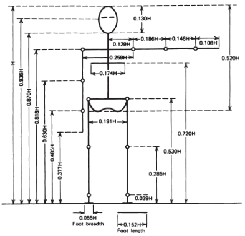
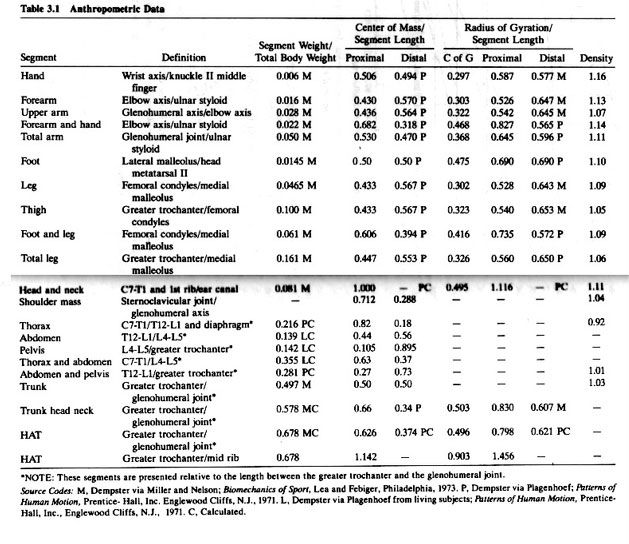
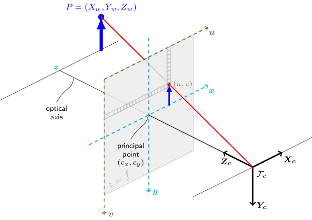

# Intro to Measurement

## Everything is/must be relative
- Cogito ergo sum (Descartes)
    - The only thing you can know for sure is that you are experiencing a conscious state right now
    - everything else requires weird stuff like `trust`, `memory`, and `statistsics`
- Skepticism as basis of scientific reality
- Origins - Eveything is/must be relative

## Measuring space and time (spatiotemporal whosits)
### Space
- 0D, 1D(`x`), 2D(`y`), 3D(`x`), etc space        
- linear
    - straight lines
    - grids, squares, cubes
- rotational
    - angles
    - circles, spheres
### Time (`t`)
- Linear
    - `t` starts at 0 and gets bigger
    - 2nd law of thermodynamics and all that
- Phasic 
        - `t` starts at 0 and loops around 
        - `pi` and whatnot 

### Everything you need to know about calculus
#### 1st order - Position - measurement (e.g. `meters`)
- Integral(Position) -> Absement(0th order, not really useful)
- Derivative(Position) -> Velocity(1st order)

#### 2nd order - Velocty - Change in position over time (e.g. `meters per second`)
- Intergral(Velocity) -> Position
- Derivative(Velocity) -> Acceleration   

#### 3rd order - Accelertion - Change in Velocity over time (e.g. `meters per second per second`)
- Integral(Acceleration) -> Velocity
- Dertivative(Acceleration) -> Jerk (then snap, crackle, and pop, but those aren't really useful)

## Units
### Base SI Units 
- https://en.wikipedia.org/wiki/International_System_of_Units
- seconds (s, time)
- meters (m, length)
- kilogram (kg, mass)
- ampere (A, current)
- kelvin (K, temperature)
- mole (mol, amount)
- candela (cd, luminance)

### Why the Metric system is cool
    - Water bottle thing
### Why the Imperial system is not actually 100% hot garbage
    - but you're still not allowed to use it (in the sciences)

### Derived units 
- Velocity: Meters per second (m/s)
- Force: Newton (N, kg * m * s^-2) 
- Energy: Joule (J, kg * m^2 * s^-2) 
    - (e.g. `The ability to do Work`, e.g. `The thing that is conserved when talking about the Conservation of Energy` )

## Everything you need to know about physics
- Newton's laws
    - First law - A body at rest/in motion stays at rest/in motion (Inertia)
    - Second law - Force = Mass * Acceleration (`F=MA`) (or 'orque = MomentOfInertia * AngularAcceleration' for rotation)
    - Third law - For every action, there is an equal and opposite reaction (Action/Reaction force)

- Conservation of energy
    - `Energy is neither created nor destroyed, it just **changes forms**`
    - Forms of Energy
        - Potential Energy:
            - Gravitational Potential Energy (PE = mass * gravity * height (m) - `m * g * h`)
            - Sprint Potential Energy (Hooks law or something - `-mass*spring_stiffness*deflection_distance`?) 
            - Chemical Potential Energy (like food and bombs and gasoline, I guess?)
        - Kinetic Energy (KE =  1/2(mv^2))
    - Mechanical Analysis        
        - Total Mechanical Energy (TME = PE + KE) (Hamiltonian or something? Lagrangian?)
        - In a 'conservative system', TME is constant

## Center of Mass ❤️✨
- Holistic approach to study of human movement 
    - "lets collapse this big weird joint angle nonsense into a singular point-mass and go from there?"
- Calculated based on `Anthropometry Tables`

- [COM gifs](com-gifs.md) <- Fun animations of yesteryear

### Pendulae!!
- The best thing around
- [Mechanical analysis of Pendulum ](https://en.wikipedia.org/wiki/Pendulum_(mechanics)#Examples)
    - TME  = PE * KE 
    - Phase plots 

### Superfast Intro to Standing Balance
- A standing human resembles (i.e. may be modeled as) an inverted pendlum 
- Your feet can (mostly) only PUSH
- The vertical projection of the Center of Mass (CoM) must stay within Base of Support (BoS)

### And looping back around again to Cameras and 3d Projective Geometry lol 
 - Pinhole Camera Model - https://docs.opencv.org/4.10.0/d9/d0c/group__calib3d.html
 - 
 - Spherical pinhole eyeball model - https://journals.plos.org/ploscompbiol/article/figure/image?size=large&download=&id=10.1371/journal.pcbi.1009575.g005
  